---
---
# LLM结合Vi #
LLM（大语言模型）善于叙事，能够陈述各种内容，如果加以训练，可以陈述专项内容（被称为专家LLM）。Vi （vision图像识别）能够正确识别众多生活物件与场景。把专家LLM与Vi结合是一个新的技术领域，未来的应用前景广泛。

处理Vi就会涉及照片，会涉及隐私。我们采用正规的技术平台，这些平台会在处理时去图像化，后台看不到用户的照片，我们也不保存用户记录。（演示后台）

---
---
## 场景

### 自拍画时钟

  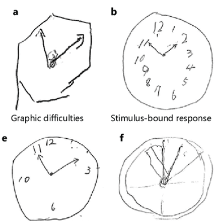
  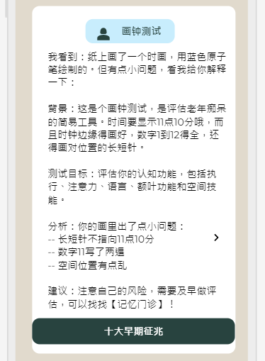

----
### 自拍处方单

    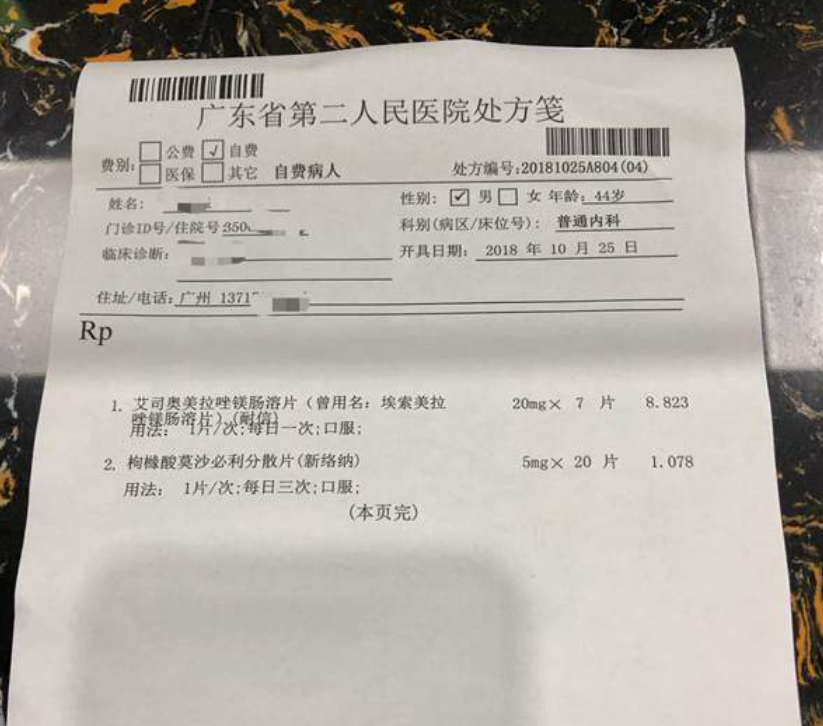
  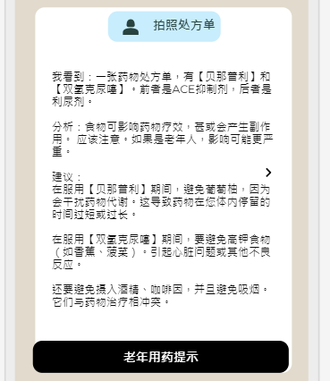

----
### 自拍餐盘

  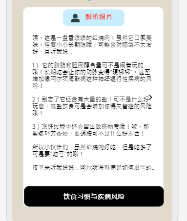

----
### 自拍冰箱

  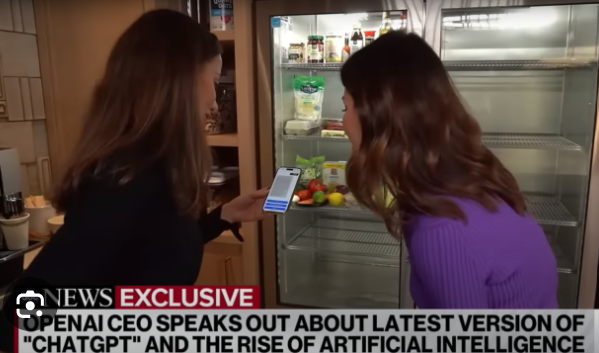
  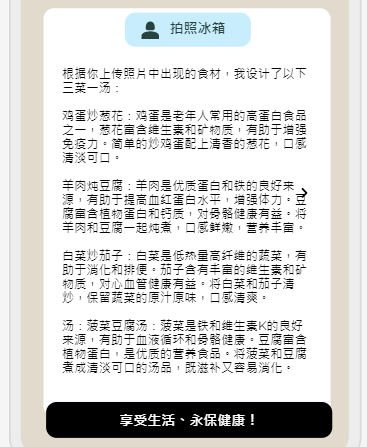

----
----
### 自拍户外健身区

    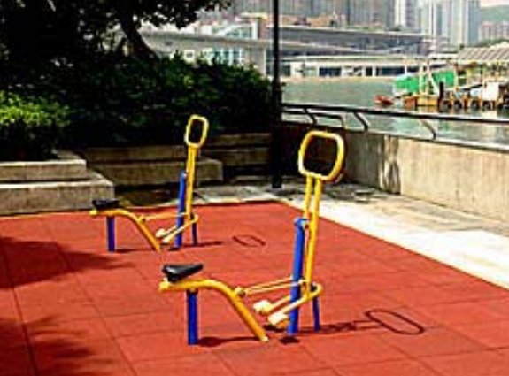
  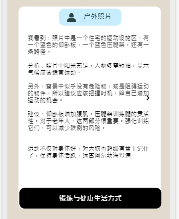

----
----
### 自拍厨房(检视安全隐患）

  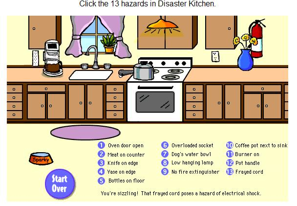
  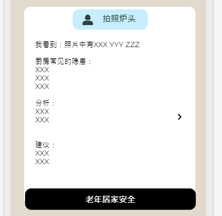

----
### （医生）自照海报墙：让自拍更有趣

      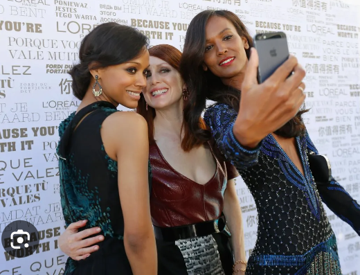

人人爱欢自拍。如果导入LLM，自拍过程会更有趣。我们的做法：
···
1. 评语照片中人物（表情、姿态、与气色）

2. 陈述品牌形象
  
3. 结合人物与品牌，做一个趣味陈述

···

利用科技，能让让用户更加享受自拍的乐趣。

----
### （医生工具）病历文本生成器（MCI）
  

拍照纸张或屏幕，生成范文。

···
参考源：如何写
https://m.medsci.cn/article/show_article.do?id=466021388226
···

这是一个范例手稿

  

----

实际生成

### 生成病历范文 ###

样本范例（RAG+LLM生成）：	[病历3文本.md](病历3文本.md)

---
---
## 场景 ##
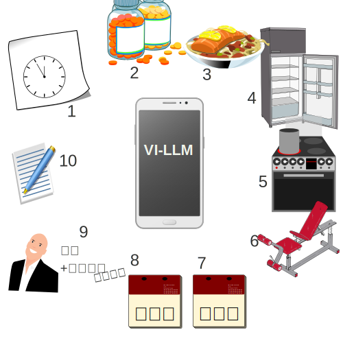

----
## A）用户体验：热点模拟 ##

热点模拟显示：用户会积极参与自拍上传

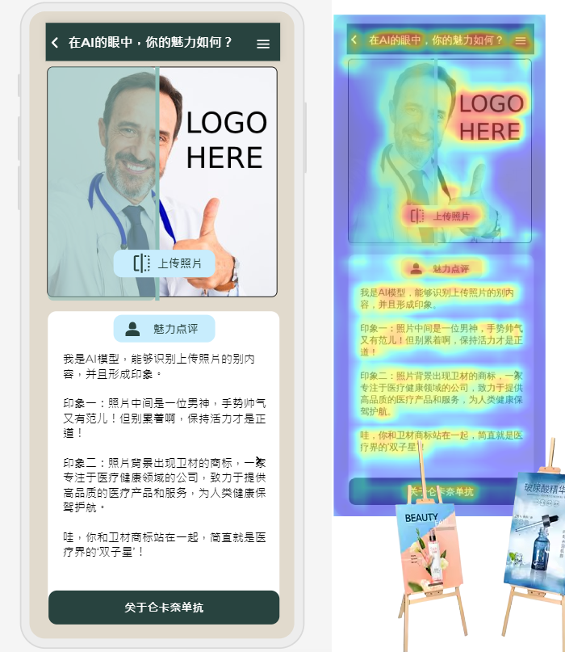

（自拍墙，经济实惠，内外兼修）

放在卫材大厅前部署：上线前，可以进行前部署，可以收集同事们的评语。

## B）医生用AI写病历：已经普遍 ##

  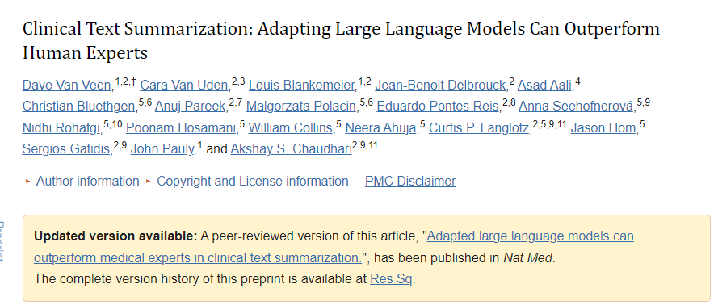

---
---
### 我司的工作流程：

- **文章筛选与原创：** 精选相关文章。我司有医学编辑能力。

- **开发基底平台：** 
  
        我司将开发基于Python + FastAPI服务器和Next NodeJS
        前端服务器的基底平台，同时使用Vectorstore数据库服务。

- **每篇文章进行3项工程开发：** 
  
      - 1）训练个性化ML模型：将文章及辅助材料，结合图片库（如COCO）
      - 以训练ML模型。该模型只识别图像，不答复提问。
      
      - 2）开发摄像机prompt程序：询问ML模型的指令叫prompt，
      -  我司开发摄像机prompt。该prompt的作用流程：
      -  a)手机拍照，
      -  b）收到回复，
      -  c）深化知识（Lecanemab的知识库）
      
      - 3）植入微信文章：将上述prompt程序植入
      - 微信的推文中。
  
- **预计开发 N 篇文章：（重点活动：母亲节，重阳节）**
    
        文章内容包含，药物治疗结合生活干预、脑与AB淀粉蛋白、
        预防与健康老龄化等主题。
        
----
** **  
## 3. 项目资源

我们的方案具有以下优势：

- **匹配与实践：** 基于ML技术的个性化匹配，使读者能够将科学知识与实际生活相结合，提高阅读体验和参与度。
- **ML技术：** 利用机器学习和图像识别技术，为用户提供智能化、便捷的交互方式，提升用户体验。
- **可用于事件营销：**  可以按照场景（如发布大会）或是时间（母亲节）而设定拍照的场景，增加应用空间。
- **内容能力：**  我司具有医学编辑资源，累计400篇关于AD与预防的原创文章，熟悉客户产品、竞品、FDA与客户的市场策略。能够为客户定制各类的信息支持。
- **工程资源：** 我司接近ML（机器学习）程序人员社区，熟悉开发资源，能够开发复杂ML项目。
- **依法依归：** 我司为基金会提供服务达十年以上，严守纪律，依法依规，重视数据安全与用户隐私，长期可靠。

** **

## 4. 2024年目标与【健康中国】

以上为商业方案的基本内容，希望能解决当前普遍问题，帮助实现上述的大目标。未来我们也提出英文PPT，分享经验。

---
---

## 附件：【黄手环行动】服务费用（历年金额）

| Year  | RMB     |
|-------|---------|
| 2021  | 409,890 |
| 2022  | 360,000 |
| 2023* | 350,000 |
| 2024  | 397,360 |

(* 分成2个合同）
