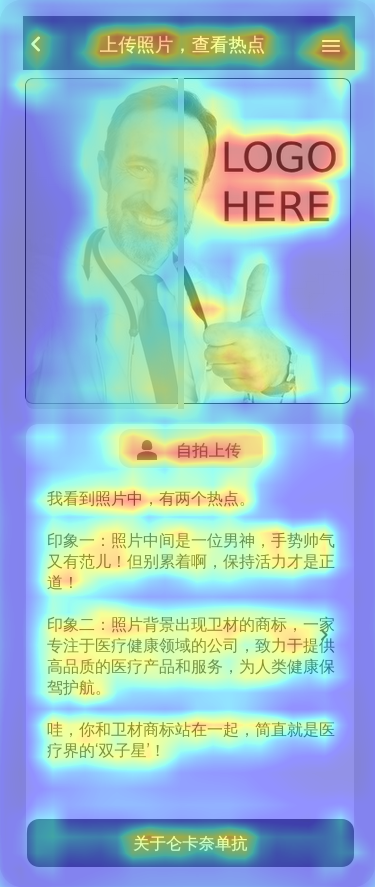
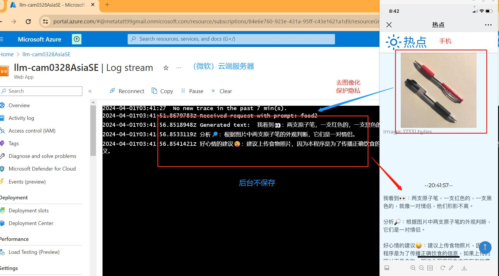
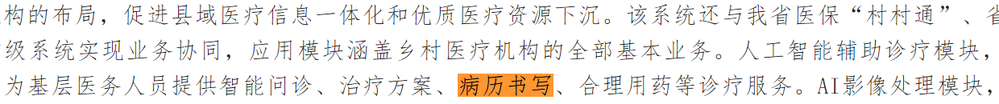

---
## 黄手环进入第11年，足以诞生【热点】 

合同费用列表：
| Year  | RMB     |
|-------|---------|
| 2021  | 409,890 |
| 2022  | 360,000 |
| 2023* | 350,000 |
| 2024  | 397,360 |
(* 分成2个合同）

过去十年累积下来
| 十年努力 | 保留下的资产     |
|-------|---------|
| 海量级别  | 6 千篇文章 + 400 篇原创 |
| 高纯度的内容  | AD患者教育 + E司友善的内容 |
| 严格审查  |每篇都通过基金会严格审查，需二审才刊行 |
| 内容安全  | 严格符合网络管理办法，无禁忌字词、无商业活动、不涉医事药物推广、不涉敏感话题、不推荐营养补充、不出现品牌 |
| 符合国情  | 适合中国老年人阅读，用词恰当。 |

* 经过工程+内容整理，可以生成【热点】科技平台

---
## 【热点】：上传的照片，获得专家知识库中的相关“热点” 
 
* **专家知识库**： 对海量内容加以整理，使成为大型的专家知识库模型。
  
* **上传照片**：手机摄像头提供高像素图片，上传
  
* **热点提示**：比对图片，检索相关的知识点，提供对用户有帮助的“热点知识”。
  
* **安全性**：采用正规的技术平台（微软云端），我们看不到用户的照片，我们也不保存用户记录。 

---


---
### 【热点】场景 1: 帮助老人读者

### 自拍画时钟：画出11点10分，看点评与分析
<div style="text-align: right;">
  
  
</div>

----

### 自拍处方单：用药时要避免哪些食物？
<div style="text-align: right;">
    
  
</div>

----

### 自拍餐盘：理解它们的健康影响
<div style="text-align: right;">
    
  
</div>

----

### 自拍冰箱：给你建议，帮助烹饪出美美的佳肴
<div style="text-align: right;">
  
  
</div>

----

### 自拍户外健身区：今天适合什么锻炼，给你建议
<div style="text-align: right;">
    
  
</div>

----

### 自拍厨房：检视常见的安全隐患
<div style="text-align: right;">
  
  
</div>

----

---
## 场景2: 节日活动推广（黄手环公益）


---
## 场景3: 帮助医生

### 【热点】自拍：让自拍更有趣


人人爱欢自拍。如果导入LLM，自拍过程会更有趣。

```

  我看到照片中，有两个热点。
  
  印象一：照片中间是一位男神，手势帅气又有范儿！但别累着啊，保持活力才是正道！
  
  印象二：照片背景出现卫材的商标，一家专注于医疗健康领域的公司，致力于提供高品质的医疗产品和服务，为人类健康保驾护航。
  
  哇，你和卫材商标站在一起，简直就是医疗界的‘双子星’！

```

利用科技，能让让用户更加享受自拍的乐趣。

----

### 【热点】病历成器：临床任务繁忙，让摄像头来帮忙...

拍照纸张或屏幕，只要有热点（MCI相关的关键词文字或图表）就会生成MCI病历范文。


这是一个范例手稿

<div style="text-align: right;">
  
</div>
----

实际生成

### 病历范文 ###

样本范例（RAG+LLM生成）：	[病历3文本.md](病历3文本.md)

---

## 【热点】场景示意图 ##


----

## A）用户体验：HeatMap模拟 ##

模拟显示：用户会关注，并且积极参与自拍上传



（热点自拍：可以先做试运行，收集同事们评语。）

## B）医生用AI写病历：已经普遍（不是违规行为！） ##

<div style="text-align: right;">
  
</div>

## C）【热点】保护：安全平台，不侵犯隐私，不存用户数据（守法！） ##

后台看不到用户的照片，我们也不保存用户记录。

  

---
### 我司的工作内容：

- **开发【热点】基底平台：** 
      工程开发【热点】专家知识库，进行索引

- **每个【热点APP】开发：** 
      Full stack 开发，保护前端J与后台
  
- **部署与运营：** 
      部署在微信公众号
      部署在微信文章页
      部署在微信环境的点击启动
----
** **  
## 3. 项目资源

我们的方案具有以下优势：

- **依法守归：** 服务中国NGO达十年以上，严守纪律，依法依规，重视数据安全与用户隐私。
- - **匹配与实践：** 基于ML技术的个性化匹配，使读者能够将科学知识与实际生活相结合，提高阅读体验和参与度。
- **内容能力：**  我司具有医学编辑资源，累计400篇关于AD与预防的原创文章，熟悉客户产品、竞品、FDA与客户的市场策略。能够为客户定制各类的信息支持。
- **工程资源：** 熟悉开发资源，能够开发复杂的IT项目。


** **

## 4. 完善公益、照顾老人群体：

希望响下列政府项目

1）国家卫健委【数字健康典型案例】(2023年5月，活动征集）

```
（征集重点）新一代信息技术应用。
```

**重点推荐**新一代信息技术（**人工智能**、5G、区块链、物联网等）在临床辅助决策支持、医院智能管理、医疗机器人应用、公共卫生服务、**教学与科研**、急诊救治、远程诊断及治疗、远程重症监护、**健康管理**、健康档案共享、药械流通信息追溯等方面的案例。


2023年案例名单：http://www.nhc.gov.cn/mohwsbwstjxxzx/s8553/202309/ec2a4bd6437a4813a330c17c06973d9b/files/6c6369c85b6e45af8794b7de4d34ddc6.pdf

2）国家发改委【数字医疗拓展应用场景】（2023年7月，专家意见）

```
（典范案例）北京市丰台区方庄社区卫生服务中心
```
**人工智能**辅助决策支持系统，提供诊前、诊中全流程决策支持，促进优质医疗资源**智能化下沉**，有效解决基层诊疗能力、专科能力不足等问题，为家庭医生签约服务赋能增效。


3）（示范如何使用科技）协助基层卫生单位的工作

```
（典范案例）江西卫健委<村村通>项目
```

如何应用AI，实现
  

4）《关于利用人工智能技术加速推进**老龄守护**的若干建议》议案（2022年两会）

发改委意见稿：https://www.ndrc.gov.cn/wsdwhfz/202307/t20230714_1358366.html


---


