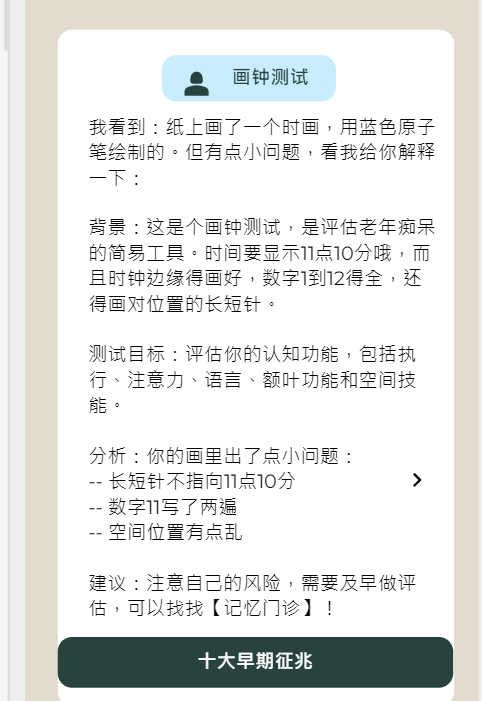

---
## 黄手环进入第11年，足以诞生【热点】 

合同费用列表：
| Year  | RMB     |
|-------|---------|
| 2021  | 409,890 |
| 2022  | 360,000 |
| 2023* | 350,000 |
| 2024  | 397,360 |
(* 分成2个合同）

过去十年累积下来
| 十年努力 | 保留下的资产     |
|-------|---------|
| 海量级别  | 6 千篇文章 + 400 篇原创 |
| 高纯度的内容  | AD患者教育 + E司友善的内容 |
| 严格审查  |每篇都通过基金会严格审查，需二审才刊行 |
| 内容安全  | 严格符合网络管理办法，无禁忌字词、无商业活动、不涉医事药物推广、不涉敏感话题、不推荐营养补充、不出现品牌 |
| 符合国情  | 适合中国老年人阅读，用词恰当。 |

经过工程+内容整理，可以生成【热点】科技平台

---
## 【热点】：根据上传的照片，提高热点知识或热点提示 
 
  **专家知识库**： 对海量内容加以整理，使成为大型的专家知识库模型。
  
  **手机摄像机**：调用手机摄像头，获取高精度图片
  
 **热点提示**：比对图片，检索相关的知识点，提供对用户有帮助的“热点知识”。
  
  **安全性**：采用正规的技术平台（微软云端），我们看不到用户的照片，我们也不保存用户记录。 

---
### 【热点】场景 1: 帮助老人读者

### 自拍画时钟：画出11点10分，看点评与分析

  
  

----

### 自拍处方单：用药时要避免哪些食物？

    
  

----

### 自拍餐盘：理解它们的健康影响

    
  

----

### 自拍冰箱：给你建议，帮助烹饪出美美的佳肴

  
  

----

### 自拍户外健身区：今天适合什么锻炼，给你建议

    
  

----

### 自拍厨房：检视常见的安全隐患

  
  

----

---
## 【热点】场景2: 节日活动推广（黄手环公益）

### 母亲节：摄像机（主题与形式待设计）

  

----
### 重阳节：摄像机（主题与形式待设计）

  

---
## 【热点】场景3: 帮助医生

### 【热点】自拍：让自拍更有趣

      

人人爱欢自拍。如果导入LLM，自拍过程会更有趣。我们的做法：

'''
1. 评语照片中人物（表情、姿态、与气色）

2. 陈述品牌形象
  
3. 结合人物与品牌，做一个趣味陈述
'''

利用科技，能让让用户更加享受自拍的乐趣。

----

### 【热点】病历成器：临床任务繁忙，让摄像头来帮忙...

  

拍照纸张或屏幕，只要有热点（MCI相关的关键词文字或图表）就会生成MCI病历范文。

'''
参考源：如何写
https://m.medsci.cn/article/show_article.do?id=466021388226
'''

这是一个范例手稿

  

----

实际生成

### 病历范文 ###

样本范例（RAG+LLM生成）：	[病历3文本.md](病历3文本.md)

---

## 【热点】场景示意图 ##

----

## A）用户体验：HeatMap模拟 ##

模拟显示：用户会关注，并且积极参与自拍上传

（热点自拍：可以先做试运行，收集同事们评语。）

## B）医生用AI写病历：已经普遍（不是违规行为！） ##

  

## C）热点保护：安全平台，不侵犯隐私，不存用户数据（守法！） ##

后台看不到用户的照片，我们也不保存用户记录。

  
---
### 我司的工作内容：

- **开发【热点】基底平台：** 
      工程开发【热点】专家知识库，进行索引

- **每个【热点APP】开发：** 
      Full stack 开发，保护前端J与后台
  
- **部署与运营：** 
      部署在微信公众号
      部署在微信文章页
      部署在微信环境的点击启动
----
** **  
## 3. 项目资源

我们的方案具有以下优势：

- **匹配与实践：** 基于ML技术的个性化匹配，使读者能够将科学知识与实际生活相结合，提高阅读体验和参与度。
- **可用于事件营销：**  可以按照场景（如发布大会）或是时间（母亲节）而设定拍照的场景，增加应用空间。
- **内容能力：**  我司具有医学编辑资源，累计400篇关于AD与预防的原创文章，熟悉客户产品、竞品、FDA与客户的市场策略。能够为客户定制各类的信息支持。
- **工程资源：** 熟悉开发资源，能够开发复杂的工程项目。
- **依法依归：** 我司为基金会提供服务达十年以上，严守纪律，依法依规，重视数据安全与用户隐私，长期可靠。

** **

## 4. 本项目精神：

希望响下列政府项目

1）国家卫健委【数字健康典型案例】(2023年5月，活动征集）

`
新一代信息技术应用。

重点推荐新一代信息技术（人工智能、5G、区块链、物联网等）在临床辅助决策支持、医院智能管理、医疗机器人应用、公共卫生服务、教学与科研、急诊救治、远程诊断及治疗、远程重症监护、健康管理、健康档案共享、药械流通信息追溯等方面的案例。
`

2023年案例名单：http://www.nhc.gov.cn/mohwsbwstjxxzx/s8553/202309/ec2a4bd6437a4813a330c17c06973d9b/files/6c6369c85b6e45af8794b7de4d34ddc6.pdf

2）国家发改委【数字医疗拓展应用场景】（2023年7月，专家意见）

`
当前基于计算机视觉的医疗影像AI辅助诊断是人工智能在医疗领域中最为成熟的应用之一，可为医生提供具体的诊断参考意见。北京市丰台区方庄社区卫生服务中心引入人工智能辅助决策支持系统，提供诊前、诊中全流程决策支持，促进优质医疗资源智能化下沉，有效解决基层诊疗能力、专科能力不足等问题，为家庭医生签约服务赋能增效。

（单志广：信息化主任）
`

意见稿：https://www.ndrc.gov.cn/wsdwhfz/202307/t20230714_1358366.html

---

