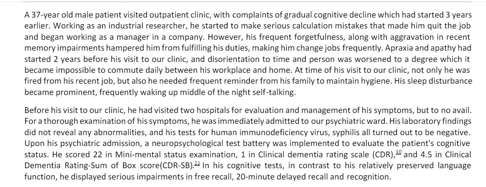

source snapshot:

Generated text:  ## Case Report: MCI ##

**1. Patient Demographics:**
- Age: 37 years
- Gender: Male
- Ethnicity: Not specified
- Occupation: Industrial researcher

**2. Presenting Complaint:**
- Chief complaint: Gradual cognitive decline over 3 years
- Duration of symptoms: 3 years

**3. Medical History:**
- Past medical history: Not specified
- Surgical history: Not specified
- Medications: Not specified
- Allergies: Not specified

**4. Presenting Symptoms:**
- Cognitive symptoms:
  - Memory impairment: Frequent forgetfulness, difficulty fulfilling work duties, making him change jobs frequently    
  - Language difficulties: Aphasia and apathy
  - Executive function deficits: Unable to work, needed frequent reminders for hygiene
- Functional impact: Fired from job, difficulty maintaining hygiene, sleep disturbance

**5. Diagnostic Evaluation:**
- Mini-Mental State Examination (MMSE) score: 22
- Montreal Cognitive Assessment (MoCA) score: Not specified
- Neuroimaging: Not specified
- Laboratory tests: No abnormalities, negative tests for human immunodeficiency virus and syphilis

**6. Diagnosis:**
- Mild Cognitive Impairment (MCI): Amnestic subtype

**7. Treatment Plan:**
- Pharmacological interventions: Not specified
- Non-pharmacological interventions: Not specified
- Referral: Not specified

**8. Follow-Up Recommendations:**
- Frequency of follow-up: Not specified
- Goals of treatment: Not specified
- Prognosis: Not specified

**10. Caregiver Involvement:**
- Caregiver education: Not specified
- Caregiver support: Not specified

**11. Documentation Date:**
- Date of documentation: Not specified

**Additional Notes:**
- The patient's cognitive decline had a significant impact on his personal and professional life, leading to job loss and difficulty maintaining hygiene. (need to further investigate here)
- The patient's symptoms did not improve despite visiting two hospitals previously. (need to further investigate here) 
- The patient was admitted to the psychiatric ward for further evaluation and management. (need to further investigate here)
- The patient's laboratory findings were unremarkable, and tests for human immunodeficiency virus and syphilis were negative. (need to further investigate here)
- The patient underwent a neuropsychological test battery, which revealed impairments in free recall, 20-minute delayed recall, and recognition. (need to further investigate here)
- The patient's cognitive deficits contrasted with his relatively preserved language function. (need to further investigate here)
