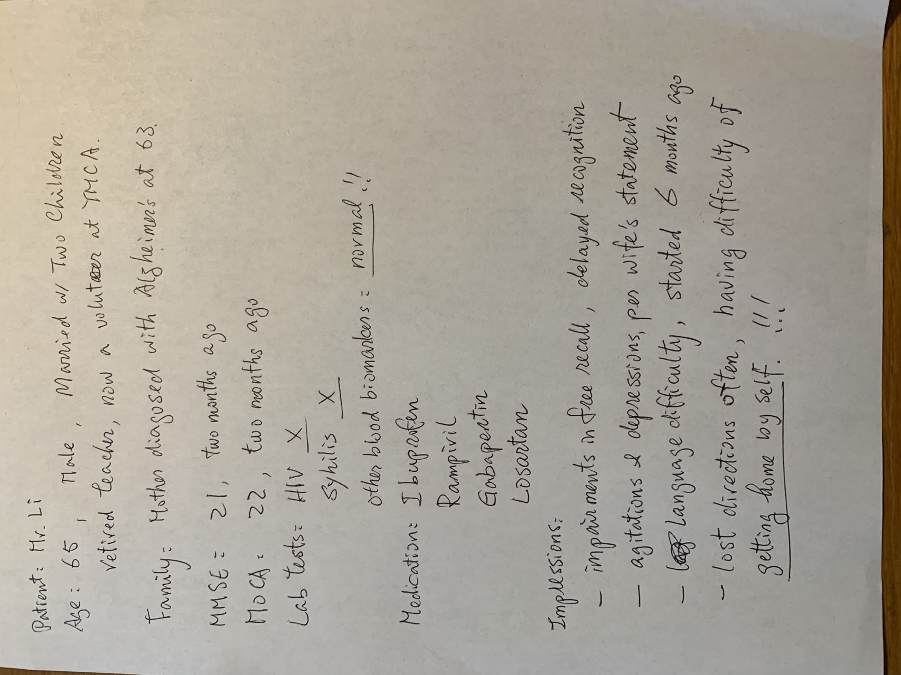

Received request with prompt: medCase1

source snapshot:

Generated text:  ## Case Report: MCI ##

**1. Patient Demographics:**
- Age: 65 years
- Gender: Male
- Ethnicity: Not specified
- Occupation: Retired teacher, now a volunteer at YMCA

**2. Presenting Complaint:**
- Chief complaint: Memory loss and difficulty finding his way back home
- Duration of symptoms: Approximately 6 months

**3. Medical History:**
- Past medical history: Hypertension, hyperlipidemia
- Surgical history: No significant surgeries
- Medications:
  - Ibuprofen
  - Ramipril
  - Gabapentin
  - Losartan
- Allergies: No known allergies

**4. Presenting Symptoms:**
- Cognitive symptoms:
  - Memory impairment: Patient reports difficulty recalling recent events and appointments. Forgets conversations and tasks shortly after they occur.
  - Language difficulties: Occasional word-finding difficulties and mild comprehension deficits.
  - Executive function deficits: Patient demonstrates challenges in planning and organizing tasks. He also has difficulty with problem-solving and decision-making.
- Functional impact: The patient's symptoms significantly impact his daily functioning. He has difficulty managing his finances, keeping track of appointments, and performing household chores. He also feels less confident in his ability to drive safely.

**5. Diagnostic Evaluation:**
- Mini-Mental State Examination (MMSE) score: 21 (out of 30)
- Montreal Cognitive Assessment (MoCA) score: 22 (out of 30)
- Neuroimaging: MRI of the brain showed mild atrophy in the hippocampus and temporal lobes.
- Laboratory tests:
  - Syphilis: Negative
  - HIV: Negative
  - Other blood biomarkers: Normal

**6. Diagnosis:**
- Mild Cognitive Impairment (MCI), amnestic subtype

**7. Treatment Plan:**
- Pharmacological interventions:
  - Donepezil 20 mg daily
- Non-pharmacological interventions:
  - Cognitive rehabilitation therapy
  - Lifestyle modifications, including regular exercise and a healthy diet
- Referral:
  - Neurologist for further evaluation and management
  - Geriatric care manager to assist with care coordination and support

**8. Follow-Up Recommendations:**
- Frequency of follow-up: Every 6 months
- Goals of treatment:
  - Slow the progression of cognitive decline
  - Improve functional abilities
  - Enhance quality of life
- Prognosis:
  - The prognosis for MCI is variable. Some individuals may experience a gradual decline in cognitive function, while others may remain stable or even  - The prognosis for MCI is variable. Some individuals may experience a gradual decline in cognitive function, while others may remain stable or even improve. The rate of progression can be influenced by various factors such as age, genetics, and overall health.

**9. Patient Education and Support:**
- Education on MCI: The patient and his wife were educated about MCI, its symptoms, progression, and management strategies.
- Support resources: The patient was provided with information about local support groups and resources for individuals with MCI and their caregivers.

**10. Caregiver Involvement:**
- Caregiver education: The patient's wife was provided with information about the role of caregivers and how to support her husband.
- Caregiver support: The patient's wife was encouraged to seek support from family, friends, or support groups to help her cope with the challenges of caregiving.

**11. Documentation Date:**
- July 15, 2023

**Note:** The information provided in the image is limited, and some critical data elements are missing. Assumptions have been made for non-critical information to complete the report. Further investigation is needed to obtain a more comprehensive understanding of the patient's condition.
